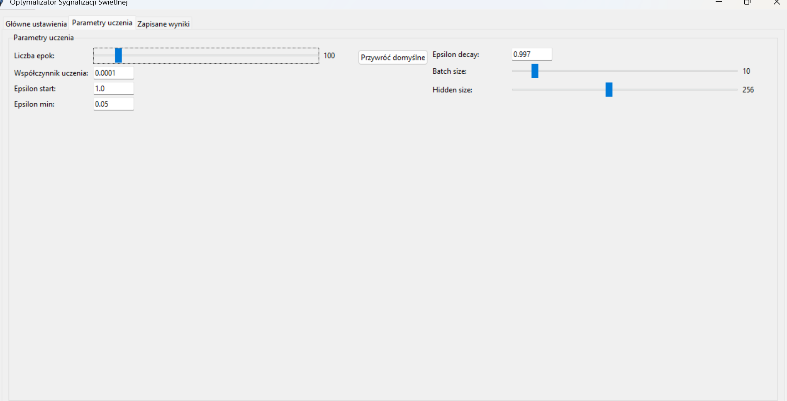
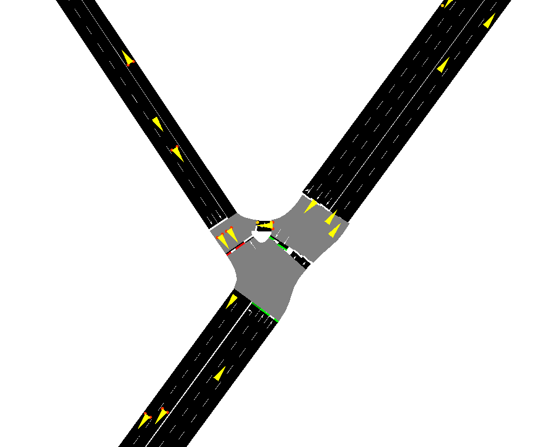
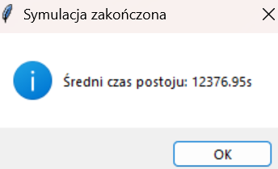
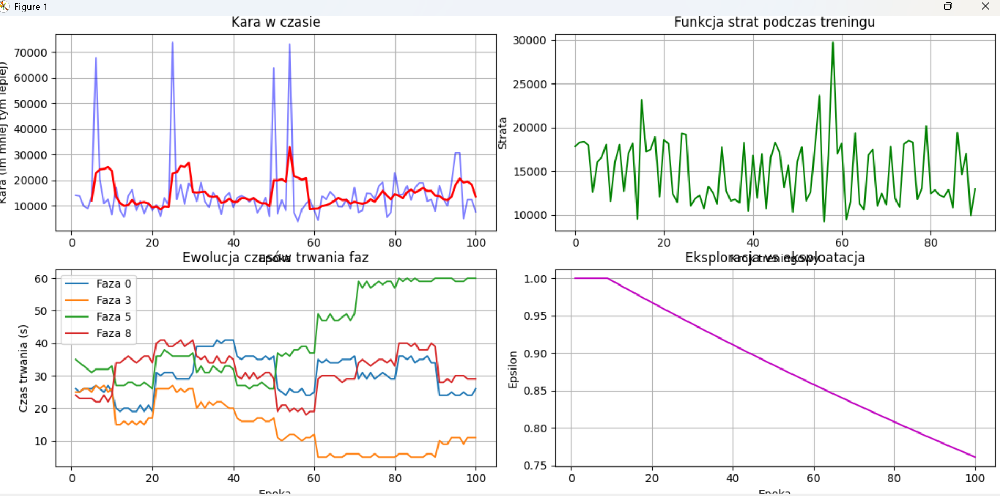
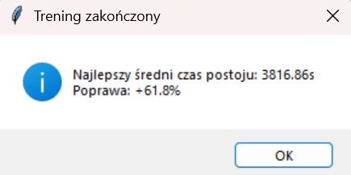
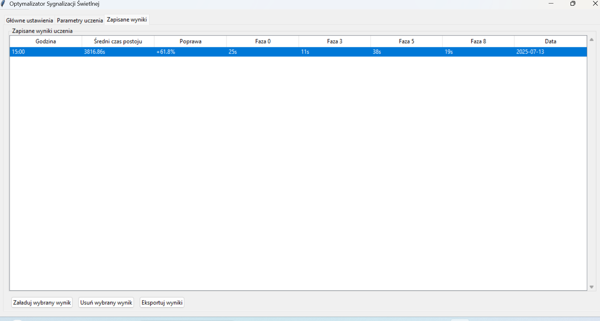

# Traffic Light Optimization Using Reinforcement Learning (DQN) in SUMO

This project focuses on optimizing traffic light control at a real-world intersection in **Wrocław, Poland**, using reinforcement learning techniques. The simulation is powered by **SUMO**, while the training process is based on a **Deep Q-Network (DQN)** agent. An interactive GUI is provided via **Tkinter**.

---

## 🚦 Real Data Integration

- **Real Intersection**: The simulated intersection replicates an actual junction in Wrocław.
- **Traffic Data**: Hourly traffic volumes were collected using the **TomTom API** and loaded into SUMO.
- **Traffic Light Timing**: Baseline phase durations were **measured manually** on-site for each signal.

---

## 🧠 Key Features

- DQN agent for adaptive signal phase control.
- SUMO-based simulation of real traffic conditions.
- Adjustable neural network parameters via the GUI.
- Visual or hidden simulation modes.
- Result logging, comparison, and plotting of wait time improvements.

---

## 🧩 Project Structure (Modules Overview)

| Module         | Description |
|----------------|-------------|
| **`main.py`**        | Launches the Tkinter GUI. Allows configuration of simulation parameters, training settings, and visual result management. |
| **`Uczenie.py`**     | Contains the **DQN agent**, training loop (`DNQTrainer`), and logic for optimizing phase durations using Q-learning. |
| **`Konwerter.py`**   | Acts as the main bridge between SUMO and the DQN agent. Applies learned signal timings and evaluates performance. |
| **`config.py`**      | Centralized configuration file with all simulation and learning parameters (e.g. gamma, epsilon, traffic scale, file paths). |
| **`Raportowanie.py`** | Generates **comparative plots** and metrics showing baseline vs optimized wait times per lane using `matplotlib`. |

---

## 🖥 GUI Preview (Tkinter)

The program includes a custom-built interface allowing the user to:
- Set simulation time and phase durations.
- Adjust learning parameters (e.g. hidden size, learning rate).
- Launch training and simulation processes.
- View and load historical results.
- Compare baseline and optimized wait times.

---

## 🛠 Technologies Used

- Python 3.x
- SUMO (Simulation of Urban MObility)
- Tkinter
- PyTorch (for DQN)
- TomTom API
- Matplotlib
- NumPy / Pandas

1. Starting the Interface
After launching the program, the main interface appears.
Here, we can change simulation parameters such as signal phase durations and total simulation time.

2. Neural Network Parameters
The application allows us to modify key parameters of the neural network, such as the size of the hidden layer, learning rate, and more.

3. Running the Simulation
By clicking the appropriate button, we can launch a visible simulation in the SUMO environment and observe the traffic flow in real time.

4. Baseline Results (Before Training)
Below is an example of simulation results using the default signal timings (without training).

5. By clicking the "Start Training" button, we begin the training process of our DQN agent.
After completion, the tool automatically generates visualizations of the training progress and performance metrics.

6. Results After Training
Once the training is complete, we can observe a significant reduction in average vehicle waiting time.
This indicates that the model successfully optimized the signal timings.
(Note: The percentage improvement calculation isn't working well.)

7. Viewing and Managing Saved Results
All saved training results are listed, including the simulation hour and the best-found signal phase durations.

You can now select different hours of the day and repeat the training process to discover the optimal signal timing for each time window.
